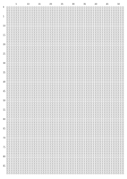

# Life Week Map

Create an A4 sheet with boxes to tick for every week of your life until age 90.

## Use the result

You can download the PDF or SVG document directly, print it and starting ticking boxes.

## Render a custom version

The SVG has been created using [Inkscape](https://inkscape.org/) and [Simple Inkscape Scripting](https://github.com/spakin/SimpInkScr). Follow the instructions on the repo for setup. Copy the `life_week_map.py` code snippet, adjust it to your needs and have it rendered using Simple Inkscape Scripting.

## Preview

